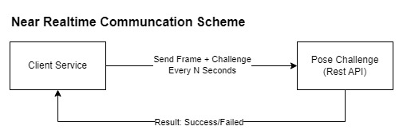

# **Project Documentation: eKYC Module - Pose Challenge System**

<p align="center">
  <picture>
    
  </picture>
</p>

The eKYC Video Challenge repository provides a robust solution for digital identity verification using AI-powered video processing. It offers a comprehensive framework for automating the Know Your Customer (KYC) process through video-based authentication, enhancing security and user experience. This module uses advanced algorithms to analyze video footage, compare it against provided documents, and confirm the authenticity of a person's identity in real-time.

## **Key Features**
- `AI-Powered Face Matching` - Uses facial recognition to verify the identity of users.
- `Real-Time Video Processing` - Ensures seamless and fast verification by processing video footage in real time.
- `Enhanced Security` - Combines multiple layers of verification to prevent fraud and identity theft.

## **Use Cases**
This eKYC module can be implemented in various industries, including:

- Banking and Financial Services: Automating customer onboarding, enhancing security for online banking, and ensuring compliance with regulatory standards.
- Telecommunications: Simplifying the user registration process and preventing fraud in SIM card activation.
- Healthcare: Verifying patient identities for telemedicine services, ensuring secure access to medical records.
- E-Commerce and Online Marketplaces: Verifying buyer and seller identities for enhanced trust and safety.
- Government Services: Enabling secure and efficient access to online public services and benefits.

By using video-based eKYC, businesses can reduce fraud, improve user experience, and meet regulatory requirements for identity verification in digital transactions.

**_Latest Updates_** 🔥
- [2024/12] [Initial Project Development] Simple pose challenge.
- [2024/12] [Reference] Implementation of realtime head pose detection project for eKYC module: [Github - Realtime Head Pose Detection](https://github.com/hanifabd/realtime-head-pose-detection)

## **How to Run App**
1. Start Pose Detector Application
    ```sh
    # NOTE: Activate the python environment before run the app !!!
    source <your_env_path>/activate

    # Run App
    uvicorn app:app --host 0.0.0.0 --port 8000 --reload

    # Run App in Background
    nohup uvicorn app:app --host 0.0.0.0 --port 8000 > app.log 2>&1 &
    ```
2. Open `index.html` in browser

## **Project Directory**
```
📂 root
├── 📂 project_docs
│   ├── 📂 examples
│   ├── 📂 project_assets
│   ├── 🐍 project_info.py
├── 📂 test
├── 📂 utils (functions and classes)
├── 📄 requirements.txt
├── 📄 README.md
├── 🐍 app.py
├── 🌐 index.html
```

# System Communication Architecture
> Pose Detection Api Documentation: http://localhost:8000/docs
<p align="center">
  <picture>
    
  </picture>
</p>

## Preview
<p align="center">
  <picture>
    
  </picture>
</p>